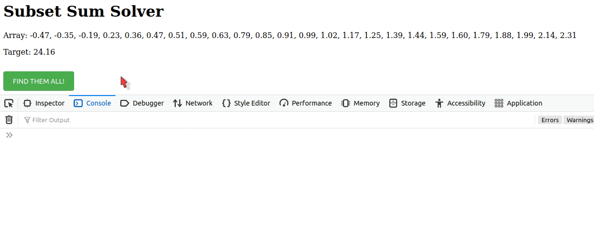
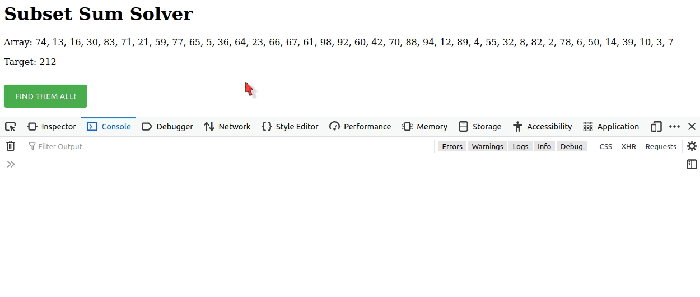

<!-- armirage subset-sum-solver README.md -->
[:earth_americas: :speech_balloon: English](https://github.com/armirage/subset-sum-solver/blob/master/docs/l10n/index.md)\
[Table of Contents](#table-of-contents)

<!-- Armirage OSS Header -->
<div align="right">
	<a href="https://armirage.github.io" target="_blank" rel="noopener">
		
	</a>
</div>

<!-- Banner -->
<div align="center" id="anchor-1">
	
	<div align="right">
		<small>"Person Holding A Golden Scoop" by cottonbro, licensed under Pexels.</small>
		<sup>
			<a href="#banner-note">[1]</a>
		<sup>
	</sup></sup></div>
</div>

&nbsp;
<!-- Content -->
<!-- Workaround to display <h1> correctly in NPM lest it duplicate rendering. -->
<!-- omit in toc -->
# <sup><em>@armirage/</em></sup>subset-sum-solver&nbsp;&nbsp;<a href="https://www.npmjs.com/package/@armirage/subset-sum-solver" alt="npm package link" target="_blank"></a>&nbsp;&nbsp;<a href="https://github.com/armirage/subset-sum-solver" alt="github repo link" target="_blank"></a>

[](https://github.com/armirage/subset-sum-solver/releases)
[](https://github.com/armirage/subset-sum-solver/issues/)
[](https://github.com/armirage/subset-sum-solver/releases)
[](https://github.com/armirage/subset-sum-solver/blob/master/LICENSE.md)
[](https://github.com/armirage/subset-sum-solver)
[](https://www.liberapay.com/armirage)

> Use a Branch-and-Bound technique with early pruning to find all subsets that equal a target. The Recursive algorithm produces a tree of child nodes. This code uses that math to output arrays of all subsets. The numbers may be negative, positive, or decimal. I estimate the average time is O(N log N) and space 2N+2.

&nbsp;
<div align="center">
	
</div>

<!-- omit in toc -->
## Table of Contents
- [About](#about)
- [Install](#install)
	- [Github Clone](#github-clone)
- [Usage](#usage)
- [Options](#options)
	- [removeDuplicates](#removeduplicates)
	- [removeZeroes](#removezeroes)
	- [returnHTML](#returnhtml)
	- [returnRaw](#returnraw)
	- [returnSubsets](#returnsubsets)
	- [returnTime](#returntime)
	- [uniqueTarget](#uniquetarget)
- [How to Contribute](#how-to-contribute)
- [Acknowledgements](#acknowledgements)
- [Contact](#contact)
- [Release History](#release-history)
- [Footnotes](#footnotes)

## About

The Github repository has an example website to [test it out yourself here](https://armirage.github.io/subset-sum-solver/).

The Subset Sum Problem (SSP)<sup id="anchor-2">[2](#ssp-wiki-note)</sup> is NP-complete, meaning roughly that while it is easy to confirm whether a proposed solution is valid, it may inherently be prohibitively difficult to determine in the first place whether any solution exists.

Variations of the SSP are the Knapsack problem <sup id="anchor-3">[3](#knapsack-note)</sup>, Traveling Salesperson, and more. The general challenge is given a set of numbers (usually positive and whole), what combination of them will add up to a target number.

An Example: Given **[ 1, 2, 3, 4 ]** what combinations equal **6**.

The answers are **[ 2, 4 ]** and **[ 1, 2, 3 ]**.

This Branch-and-Bound technique with early Pruning, is a recursive formula. Meaning the problem to solve for 6, is broken down into smaller targets like 2 and 4.

Each iteration of the function looks at each number in the array and asks 3 simple questions.
* Does this number match the target? If 'yes' take the number and complete a subset.\
  or
* Is this number "Not Too Big"?
* Is this number "Not Too Small"?

If yes to both of those, take the number and subtract it from the target. Creating a new target to solve for.

**The Math is simple, easy learn, and can be done by hand.**

As it builds a tree of child nodes each branch represents a subset that solves for the overall target number. It looks at each number much like Dynamic Programming or a Naive combination approach. However it saves time by ignoring numbers that are larger than the number being looked at and numbers that have been drawn out as child nodes already. Reducing the list each iteration.

It saves space by referring to an associative array of the inputs and their relative value. Each iteration is looking at the same object in memory.

O(N log N) time is misleading. Any subset sum algorithm can be given a set that slows its performance to the same speed as regular combination finding.

A zero can be inserted into any and all subsets with out incident. Having one zero in the inputs doubles all branches. Having two, quadruples the branches. Because the output will be the normal branches, all the normal branches plus one zero, all branches plus the other zero, and finally all branches plus both zeroes.

For this reason, zeroes are removed by default.

The worst time for this algorithm, can be achieved by allowing zeroes, and passing in an array of [ 0,0,0,0,0,0,0,0,0,0 ] with target "0".

For similar reasons duplicates of the target number within the input double branches (usually with out significance). By default target numbers found in the input are reduced to multiplicity of one.

The performance of the algorithm is dependent on the spread of numbers. And the branches it must explore. To include "Dead Branches" as well. The algorithm is heuristic in how it grabs child nodes. If there are large valued negatives compared with smaller discrete positives, the recursion will travel down many dead ends.

The example at the top of the README displayed an input array of:\
[ -0.47, -0.35, -0.19, 0.23, 0.36, 0.47, 0.51, 0.59, 0.63, 0.79, 0.85, 0.91, 0.99, 1.02, 1.17, 1.25, 1.39, 1.44, 1.59, 1.60, 1.79, 1.88, 1.99, 2.14, 2.31 ]\
Target: 24.16

25 input numbers found 6 solutions in .007 seconds. Compare that to the following screen grab.

&nbsp;
<div align="center">
	
</div>

The animated short shows an input array of: [ 74, 13, 16, 30, 83, 71, 21, 59, 77, 65, 5, 36, 64, 23, 66, 67, 61, 98, 92, 60, 42, 70, 88, 94, 12, 89, 4, 55, 32, 8, 82, 2, 78, 6, 50, 14, 39, 10, 3, 7 ]\
Target: 212

40 inputs; found 234,162 solutions in 2.486 seconds.

There is consistent trend of 120-140 random number inputs to take a minute to solve. With varied success even longer depending on the shape of the negative numbers. I am inclined to think this is the number of branches that correlate with increased inputs.

Right now it is for general purpose. For more info on increasing performance, see [How to Optimize](#how-to-optimize).

## Install

To install, run the following in the terminal.

```console
npm install @armirage/subset-sum-solver --save-dev
```
* :pencil: NOTE: The plugin is a scoped npm package and will need to be referenced that way.

To complete installation See [Usage](#usage).

### Github Clone

If you are starting with the Github download, run in the terminal.

```console
npm install
npm run build:release
```
The "build:release" script will create documentation in `docs` folder, a `release` folder and files.

Then from with in the `tests` folder run the follow commands:
```console
npm install
http-server
```

The webpage must be requested from a server. I use [http-server](https://www.npmjs.com/package/http-server) for development.

To complete installation See [Usage](#usage).

## Usage

Once the subset-sum-solver package is installed, you can add the following code to a webpage. A better implementation is surely possible (@TODO list)

// index.html
```html
<script type="module">
	import { returnSolutions } from "./node_modules/@armirage/subset-sum-solver/index.js";
	let multiset = [ 1, 2, 3, 4, 5 ];
	let target = 7;


function displayOutput() {

	let settings = {
		"removeDuplicates": false,
		"removeZeroes": true,
		"returnHTML": false,
		"returnRaw": false,
		"returnSubsets": true,
		"returnTime": true,
		"uniqueTarget": true
	};

	const reply = returnSolutions(target, multiset, settings);

	console.log("Time:", reply.time);
	console.log(reply.subsets.map(array => array.join(",")));
</script>
```
* :pencil: NOTE: The plugin is a scoped npm package and will need to be referenced that way.

## Options

*\* Any Option not passed to the returnSolutions function will use its default value.*

### removeDuplicates
Type: `Boolean`\
Default value: `false`

> Removes duplicate entries from the input.

To remove duplicates, set to `true`.

```javascript
let inputArray = [ 1, 1, 1, 2, 3, 4, 4, 5 ];

// Converts to: [ 1, 2, 3, 4, 5 ]
```
### removeZeroes
Type: `Boolean`\
Default value: `true`

> Removes zeroes from the input.

To keep zeroes within the input array, set to `false`.

```javascript
let inputArray = [ 0, 1, 2, 0, 4, 5 ];

// Converts to: [ 1, 2, 4, 5 ]
```
### returnHTML
Type: `Boolean`\
Default value: `false`

> Returns a DOM fragment for inserting into an html document.

To get with the return object an html fragment, set to `true`.

```javascript
let settings = {
	"returnHTML": true
}
let reply = returnSolutions( target, inputArray, settings );

document.getElementById( "outputDiv" ).appendChild( reply.html );
```
### returnRaw
Type: `Boolean`\
Default value: `false`

> Returns an array of strings in the format of "number^index, number^index". This si the raw output of the findSubsets function. Multiplicity of the inputNumbers is maintained by carrying their index in a string. With the sorted original array a comparison could be made to decorate the number with a custom multiplicity.
> IE: instead of 1<sup>a</sup>, 1<sup>b</sup>... someone could take the raw data and superscript numbers instead.

To get an array of raw strings (one per subset), set to `true`.

```javascript
let settings = {
	"returnRaw": true
}
let reply = returnSolutions( target, inputArray, settings );

customSuperscript( reply.raw );
```
### returnSubsets
Type: `Boolean`\
Default value: `true`

> Returns an array of arrays. One array per subset found. Each array is a composed of numbers.

To forego getting an array of numbers (one per subset), set to `false`.

```javascript
let settings = {
	"returnSubsets": true
}
let reply = returnSolutions( target, inputArray, settings );

reply.subsets.forEach((array) => console.log(array));
```
### returnTime
Type: `Boolean`\
Default value: `false`

> Returns the performance.now() time of the findSubsets function. This includes sorting the input array.

To get Time as a string of "x seconds", set to `true`.

```javascript
let settings = {
	"returnTime": true
}
let reply = returnSolutions( target, inputArray, settings );

console.log( reply.time );
```
### uniqueTarget
Type: `Boolean`\
Default value: `true`

> When the input array has duplicates of the target number branches duplicate. By default this explosive behavior is maintained by limiting the input array to containing one number equal to the target number.

To allow duplicates of the target number in the input array, set to `false`.

```javascript
let inputArray = [ 1, 2, 4, 2, 5, 1, 2, 5 ];
let target = 2;

// Converts to: [ 1, 1, 2, 4, 5, 5 ]
```
## How to Contribute

Review the [Contributing Guidelines](https://github.com/armirage/.github/blob/master/CONTRIBUTING.md) for ways to make this repository better.

Open Source Software (OSS) is only as strong as our Community.

If any Mathematicians would like to work together, I have notebooks of intriguing tangents this endeavor took me upon. It was not easy.

<a href="https://liberapay.com/armirage/donate"></a> &nbsp; Thank you!

## Acknowledgements

Thank you to CooManCoo <sup id="anchor-4">[4](#coomancoo-note)</sup>, his JavaScript implementation of a "Rolling Wheel" was the fastest Subset Sum Problem solver I could find. I used it to validate my results.

## Contact

Armirage Github repositories and @armirage scoped NPM modules are maintained by [Armirage](https://www.armirage.com), A Father and Son technology solutions company, feel free to <a href="mailto:helloyall@armirage.com">contact us</a>!

## Release History 

- 2020-10-11 Begin

## Footnotes

<b id="banner-note">[1]:</b> ["Person Holding A Golden Scoop"](https://www.pexels.com/photo/person-holding-a-golden-scoop-3737652/) by [cottonbro](https://www.pexels.com/@cottonbro), licensed under [Pexels](https://www.pexels.com/license/) [:arrow_heading_up:](#anchor-1)

<b id="ssp-wiki-note">[2]:</b> Subset Sum Problem <https://en.wikipedia.org/wiki/Subset_sum_problem/> [accessed 11 October 2020] [:arrow_heading_up:](#anchor-2)

<b id="knapsack-note">[3]:</b> Knapsack Problem <https://en.wikipedia.org/wiki/Knapsack_problem/> [accessed 11 October 2020] [:arrow_heading_up:](#anchor-3)

<b id="coomancoo-note">[4]:</b> CooManCoo - Recursive Algorithm <https://stackoverflow.com/questions/18305843/find-all-subsets-that-sum-to-a-particular-value/30222026/> [accessed 11 October 2020] [:arrow_heading_up:](#anchor-4)

&nbsp;

&nbsp;

<div align="right">
  <p>Armirage logos Copyright © 2020, Clinton Mulligan. All rights reserved.</p>
</div>
</https:>
